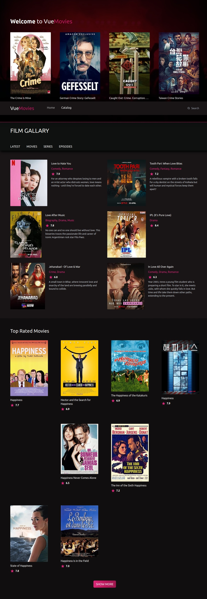
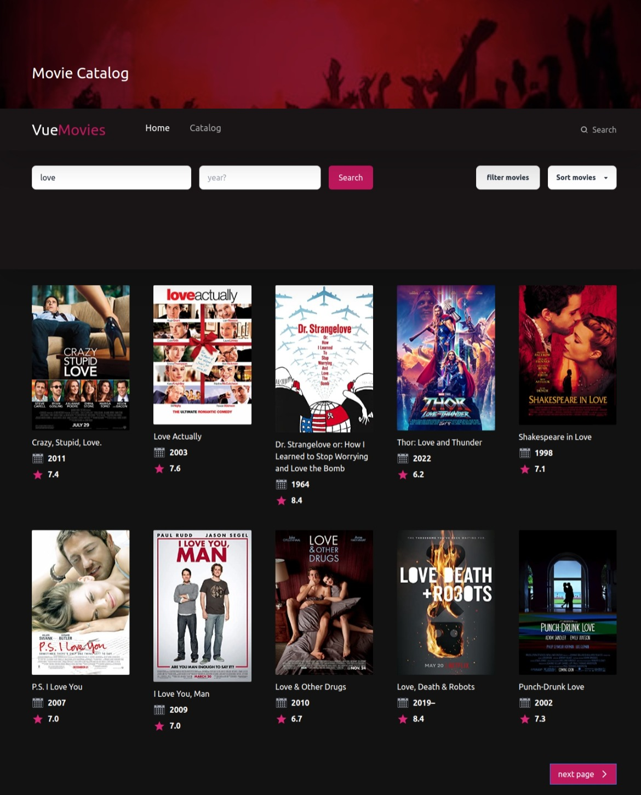
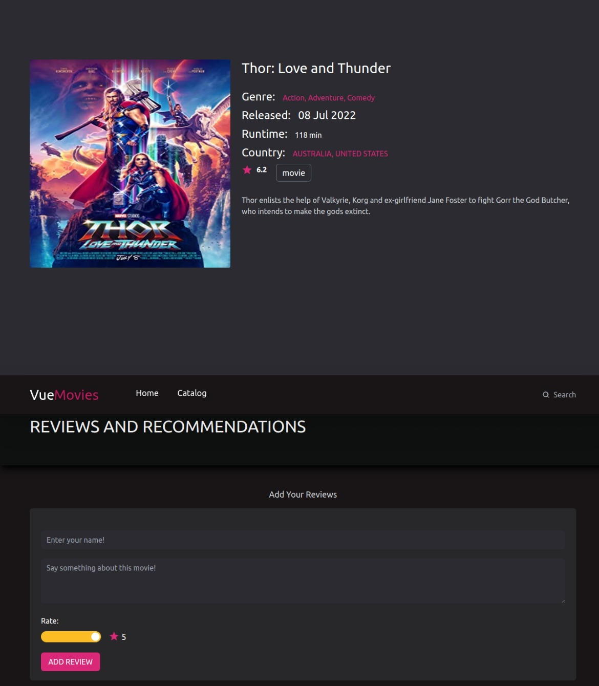

# VueMovieRating

This is a movie site application built with Vue 3, Tailwind CSS, and the OMDB API. The application provides various functionalities to browse and explore movies, including a catalog section, search functionality, sorting options, filtering by genres, and the ability to add reviews to individual movies.

## Table of Contents

- [Live Site](#live-site)
- [Screenshots](#screenshots)
- [Installation](#installation)
- [Usage](#usage)
- [Features](#features)
- [Future Implementation/Improvement](#future-implementationimprovement)
- [Technologies Used](#technologies-used)
- [Contributing](#contributing)
- [License](#license)

## Live Site

[VueMovies App](https://kings-vue-movies.netlify.app/)

## Screenshots

## Installation

1. Clone the repository: `git clone https://github.com/Ericwiz/VueMovieRating.git`
2. Change to the project directory: `cd VueMovieRating`
3. Install dependencies: `npm install`

## Usage

1. Obtain an API key from the OMDB API website (https://www.omdbapi.com/) by signing up for an account.
2. Create a `.env` file in the root of the project and add your API key:             VITE_API_KEY=your-api-key
3. Start the development server: `npm run dev`
4. Open your browser and visit `http://localhost:5173/` to access the site.

## Features

The movie site application offers the following features:

- **Basic App**: A basic app with different sections on the hompage.
- **Catalog Section**: Displays a list of movies from the OMDB API.
- **Search Functionality**: Allows users to search for movies by title and release year.
- **Sorting Options**: Provides sorting options to arrange movies by year, title, and rating.
- **Filtering by Genres**: Enables filtering movies by different genres.
- **Movie Details Page**: Shows detailed information about a selected movie, including the plot, rating, and more.
- **Review Functionality**: Allows users to add reviews to individual movies.

## Future Implementation/Improvement

The following features are planned for future implementation and improvement:

- **Movie Recommendation**: Provide personalized movie recommendations based on user preferences and viewing history.
- **Custom Movie Lists**: Allow users to create and manage their own custom movie lists, such as favorites or watchlists.
- Improve pagination

## Technologies Used

The movie site application is built using the following technologies:

- Vue 3: A progressive JavaScript framework for building amazing user interfaces.
- Tailwind CSS: A utility-first CSS framework for quickly styling the application.
- OMDB API: An API for accessing movie information, including details, ratings, and reviews.

